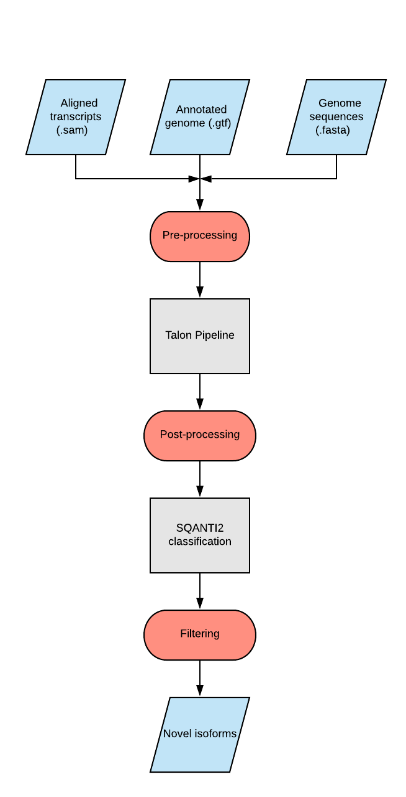

# Isoseq to Isoforms
## Long-read sequencing
Long-read sequencing is becoming a powerful tool to analyze genomics and transcriptomics using technologies such as PacBio, Oxford Nanopore, and SLR-Seq. In transcriptomics, long-read sequences allow for the identification and discovery of novel isoforms that can help characterize complex transcriptomes. As this technology continues to progress and is applied to more projects, the number of reads will rise exponentially. It is imperative to have tools available to process these data accurately and reproducibly to curate new 'knowledge'.

## What is the problem?
One of the main issues with processing long-read sequences is the large number of alignments. To manually curate each alignment for novel isoforms is time consuming and redundant. 
There are current pipelines such as TALON which can use alignments as input and process them to (1) collapse what can be considered the same transcript isoforms, and (2) classify the collapsed set to indicate known and novel isoforms in the dataset. TALON, in particular, is platform-agnostic but other pipelines that tackle similar problems are designed to work best with read data obtained from a specific platform. 
Another problem with analyzing and annotating long-read data is low transcript quality that can misinform novel isoforms.
SQANTI2 pipeline can further verify and annonate isoform data to give higher confidence in transcript quality and identify. This is acheived by utilizing data from external sources such as CAGE and polyA seq analyses to inform the novelty of a 5' and 3' terminus, respectively. 

## What is Isoseq to Isoforms
This pipeline will take alignment data and use existing pipelines to collapse and classify the alignments to output a table of high-quality novel isoform transcripts. Specifically, this pipeline will pre-process alignment data and reference genomes to be compatible with the TALON pipeline. It will then post-process TALON output to be compatible with SQANTI2 classification. Finally, the SQANTI2 output is filtered to only include high-quality novel isoforms.

## Dependecies
### Software
* [TranscriptClean](https://github.com/dewyman/TranscriptClean) to correct mismatches, microindels, and noncanonical splice junctions in long reads that have been mapped to the genome
* [TALON](https://github.com/dewyman/TALON) is a pipeline to collapse and classify aligned reads
* [SQANTI2](https://github.com/Magdoll/SQANTI2) is a pipeline to classify alignments based on CAGE, polyA, and RNA-seq data
* [cDNA_Cupcake](https://github.com/Magdoll/cDNA_Cupcake) in order to use SQANTI2

### Data
* Genome and Annotation
    * Human genome (GCF_000001405.39 GRCh38.p13)
    * RefSeq annotation (AR109.20200228)
    * GENCODE annotation (GENCODE v33)
* [Support Data](https://github.com/Magdoll/images_public/tree/master/SQANTI2_support_data) provided with the SQANTI2 pipeline. Includes: 
    * Transcription start sites from the FANTOM5 project
    * Polyadenylation sites from the RefSeq group 
    * Intron features from the Intropolis project

## Pipeline summary

## Input data
Most input data files had to be reformatted to some extent to ensure compatibility with one or more tools in the pipeline. 

1. **Alignment files** in sam format were used. However, we reformatted them to replace the extended `X=` notations in CIGAR string with `M` using the `reformat_sam.py` script. Additionally, this script restricts the input alignments to the human chromosomes and mitochondrion only and removes any alignments mapping to the unplaced scaffolds, unlocalized scaffolds, and alternate loci. 

2. **Genome annotations** in gtf format need to have transcript and gene feature lines but RefSeq GTF files lack the transcript lines. We processed the RefSeq GTF files to add these lines before use. 

3. **Genome** data in fasta format was used. We pre-processed these files using `reformat_fasta.py` to remove titles from the headers and keep only the seq-id. 

## Workflow
We created wrapper scripts for each step in the pipeline and run them as shown below: 
1. Clean alignments using TranscriptClean and prepare them for TALON 

    `run_txclean.sh -i <input_sam> -o <output_prefix> -g <genome_fasta> -j <splice_juncs> -t <threads>`

2. Run `talon_label_reads` to label internally primed transcripts. These will be filtered out in a subsequent step. 

    `run_talon_label_reads.sh -i <input_sam> -o <output_prefix> -g <genome_fasta> -r <range_size> -t <threads>`

3. Initialize the database to run TALON

    `run_talon_initialize_database.sh -i <input_gtf> -o <output_prefix> -g <genome_name> -a <annotation_name>`

4. Run TALON to collapse and classify alignments

    `run_talon.sh -i <config_file> -o <output_prefix> -d <talon_database_name> -g <genome_name> -t <threads>`

5. Run `talon_filter_transcripts` to remove internally primed transcripts

    `run_talon_filter_transcripts.sh -d <talon_db> -o <output_prefix>`

6. Run SQANTI2 on the TALON output gtf files 

    `run_sqanti.sh -i <input_gtf> -a <annotation> -g <genome_fasta> -l <polyA_motif_list> -p <polyA_peak> -c <cage_peaks> -s <splice_junctions>  -t <threads>`

## Output files 
Both TALON and SQANTI2 output files will be inspected to identify novel isoforms. Specifically, the GTF files produced by TALON were processed using the `gen_novelty_tracks_gtf.py` to produce individual GTF files with classified transcripts. These GTF files were uploaded to NCBI Genome Data Viewer and further examined to identify novel isoforms. 

## Future directions
* Adapt multiple genome references to be used with TALON 
* Adapt formatting for other genome references beside RefSeq

### Team
* [Vamsi Kodali](https://github.com/vkkodali)
* [Fairlie Reese](https://github.com/fairliereese)
* [Elizabeth Hutchins](https://github.com/e-hutchins)
* [Catherine Giannetti](https://github.com/cgiannetti)

